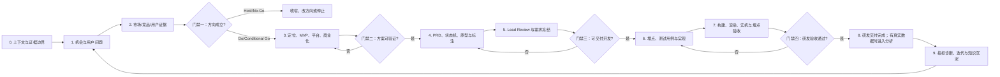

# 历史资产盘点与出海产品完整工作流 v1.0

> 适用范围：C 端出海 App，默认 Android / Google Play 优先，iOS / App Store 次之。
> 文档目的：把过去完成的项目、沉淀的方法和已有 Skill 串成一套可复用、可路由、可验收的产品工作流。
> 当前结论：**可以整合，但不应合并成一个大而全的 Skill。最佳结构是“1 个主控工作流 + 7 个专项 Skill + 4 道阶段门禁 + 1 套证据状态”。**

---

## 0. 结论先行

我们过去的工作已经覆盖了一条出海产品链路的大部分关键环节：

`市场与方向判断 → 竞品证据 → 定位与 MVP → 商业化/政策 → PRD → 原型与标注 → 评审 → 埋点 → 实机验收 → 研发交付与复盘`

真正缺的不是更多零散 Skill，而是以下四个连接件：

1. **主控路由**：根据当前任务决定调用哪些 Skill、跳过哪些阶段。
2. **阶段交接合同**：统一每一阶段的输入、输出、完成标准和证据等级。
3. **门禁机制**：方向不成立不进入原型；需求没闭环不进入埋点；没有实机证据不宣称验收通过。
4. **持续迭代闭环**：把已有产品数据、评审意见和真实失败案例反哺到方法库，而不是只存项目结论。

推荐新建一个主控 Skill：

`overseas-consumer-app-lifecycle`

它只负责任务识别、阶段编排、门禁和交接，不复制现有专项 Skill 的正文。现有 `overseas-consumer-app-workflow` 保留，作为“新品发现与立项”阶段的核心子 Skill。

---

## 1. 历史工作资产地图

### 1.1 已形成稳定方法的主线

| 主线 | 代表性工作 | 已沉淀的方法 | 当前证据状态 |
|---|---|---|---|
| 新品判断 | Doc Reader、PDF Reader / All Docs、Android Emulator | 从市场、用户、竞品、定位、MVP、商业化、政策、预研、指标推导 Go/Hold；先判断方向，再写功能 | 方法成熟；个别市场结论需实时刷新 |
| 产品边界 | PDF Reader vs All Docs、Reader-first | 用“用户任务深度”而非文件格式数量切产品边界；核心循环比功能总数更重要 | 已多次复用 |
| 竞品研究 | Android 实机走查、商店页、Paywall、广告、评论、AppGoblin/Sensor Tower | 商店证据、实机证据、第三方估算分层；第三方数据用于趋势/相对排序，不冒充真实收入或用户级归因 | 方法成熟；第三方数据需标口径 |
| 商业化 | PDF Reader IAA、订阅、Trial、广告频次、推送 | 变现应匹配价值频率；广告放在任务之间而非任务之中；订阅状态与历史资格分离；频次规则必须可计算 | 方法成熟，政策要实时核验 |
| PRD 与状态闭环 | Printer、Reader、Flight、Fake GPS、Heart Rate | 主路径之外必须覆盖 loading / empty / fail / timeout / permission / interrupted / restore；需求与原型可追溯 | 方法成熟 |
| 原型交付 | HTML 低保真、Axure、蓝湖、状态拼版 | 左侧页面效果、右侧中文需求和美术/交互标注；英文 UI Copy 保留；优先复用 RP11 组件库 | HTML 路径稳定；Axure 直接写入能力未完全验证 |
| 交付评审 | Tivadar/Lead Review | 先审业务目标、用户路径、信息架构和功能排布，再审字段、状态、文案；确证原则与推测原则分层 | 已形成独立 Skill |
| 埋点设计 | Printer 友盟埋点、设备规格、Fake GPS | 先明确产品问题与漏斗，再设计事件；点击不代表成功；结果事件覆盖 success/fail/cancel/timeout | 已形成独立 Skill 和模板 |
| 埋点验收 | Android ADB + 设备端埋点工具 | PASS 必须匹配事件 ID、参数和值、触发时机；FAIL 才截图；BLOCKED/NOT_RUN 写原因 | Skill 已创建并结构校验；真实项目实机跑通证据仍缺 |
| 工程与交付 | ASTRA Android、竞品分析平台、Windows 工具、GitHub | 先区分静态检查、构建、渲染、实机、Live API E2E；工程同步前查 secrets、remote、branch、工作区状态 | 工程交付流程可复用 |
| 知识管理 | Notion Hub、Codex 历史恢复、Memory | 当前用户确认优先于历史；只在明确授权后同步 Notion；历史内容要带版本和证据状态 | 规则成熟 |

### 1.2 过去工作中最值得保留的认知

1. **产品不是功能集合，而是一条可重复的价值链。** 例如 Reader 的核心不是“支持多少格式”，而是 `文件 → 可读页面 → 可继续阅读`。
2. **方向判断要早于原型。** 目标用户、真实痛点、获客、首次价值、留存、变现任一环不成立，继续画页面只会把错误做得更完整。
3. **产品证据有等级。** 计划、生成文件、静态检查、渲染检查、实机验证、线上数据不是同一个完成度。
4. **平台差异不能靠复制。** 共用用户价值写一次；权限、后台、购买和 Ads/Tracking 分别写 Android 与 iOS。
5. **商业化不能破坏核心任务。** 用户首次价值未建立前，强 Paywall、全屏广告或过早权限请求通常同时伤害激活、留存和信任。
6. **原型必须能脱离交互被评审。** 关键状态应展开成独立页面，不能把核心规则藏在 Dynamic Panel 或口头说明里。
7. **埋点不是点击清单。** 每个事件必须回答一个产品问题；关键异步流程必须区分用户意图和最终结果。
8. **当前事实优先。** 当前用户确认和当前原型高于旧文档、历史记忆和通用模板。

### 1.3 历史新品需求文档模板：必须纳入工作流

上一轮资产盘点偏重 Skill，遗漏了历史新品需求文档本身。Heart Rate、Printer、PDF Reader、Doc Reader 已经形成了一条清楚的模板演进线：

| 模板层 | 历史代表 | 主要职责 | 在工作流中的位置 |
|---|---|---|---|
| 新品分析层 | `新品Heart+Rate+.pdf`、`新品需求分析_PDF Reader_V0.3_Heart模板版.md`、`新品Printer分析文档.md` | 市场、用户、竞品、定位、范围、功能、流程、商业化、预研和立项判断 | 方向门禁前后 |
| 产品框架层 | Heart Rate Axure 中的 `需求框架`、`产品流程`、`版本信息`、`预研需求` | 把产品策略拆成版本、模块、主流程和依赖 | 方案门禁之后 |
| 页面需求层 | Heart Rate 的启动、主页、测量、趋势、Insight、设置、订阅页面；Reader/Printer 页面需求 | 页面进入、展示、交互、状态、数据、异常和 AC | 开发交付门禁之前 |
| 测量与验收层 | 埋点表、测试用例、设备端校验报告 | 证明需求是否被正确实现、是否能回答产品问题 | 研发验收门禁之前 |

Heart 模板的价值不只是章节名称，而是它的写法：**每章先给判断，再给证据和产品影响；先形成完整产品故事，再进入页面细节。** 当前 0–12 章模板应作为结构标准，继续保留 Heart 风格的叙述和结论密度，避免变成只填表的空壳模板。

原始文件已在 `C:\Users\simon\Documents\xwechat_files\z837965210_36a6\msg\file\2026-08\新品Heart Rate .pdf` 找到并验证为 20 页；Heart Rate Axure 导出和 `Heart模板版` PDF Reader 文档作为页面与衍生模板补充证据。

---

## 2. 已有 Skill 资产盘点

### 2.1 核心专项 Skill：保留并纳入主工作流

| Skill | 在完整工作流中的职责 | 成熟度判断 | 处理建议 |
|---|---|---:|---|
| `overseas-consumer-app-workflow` | 市场、用户、竞品、定位、MVP、商业化、政策、预研、指标、Go/Hold | 高 | 保留为“发现与立项”子流程，不扩成全生命周期巨型 Skill |
| `android-app-screenshot` | Android 竞品实机走查、截图、Paywall/广告/权限证据、双设备流程、报告/拼版 | 高 | 作为竞品证据与实机体验研究入口 |
| `prd-prototype-standard` | 完整 PRD 与原型交付包标准、页面状态、AC、蓝湖分组 | 中高 | 作为正式需求包标准；负责“包结构” |
| `prototype-requirement-writer` | 单页/单流程低保真、中文需求说明、边界状态、HTML 原型 | 高 | 作为快速原型和页面级需求执行器；负责“页面内容” |
| `lead-review` | 上会/提测前按已确认 reviewer 标准挑刺，区分确证与推测 | 中高 | 作为交付门禁，不与通用 QA 合并 |
| `tracking-spec-from-prototype` | PRD/原型/蓝湖/Axure/Figma → 研发可执行埋点表 | 高 | 作为需求冻结后的测量设计入口 |
| `tracking-implementation-validator` | 埋点表 → Android 实机操作 → 设备端埋点工具验收 | 中 | 保持独立；下一步需要真实项目跑通并补充运行案例 |

### 2.2 可按需调用的通用 Skill

这些能力不应该每次都跑，只在命中对应问题时调用：

| 任务 | 建议 Skill |
|---|---|
| 市场、商店数据、评论研究 | `market-researcher`、`competitor-analysis`、`sentiment-analysis` |
| 商业化和定价 | `monetization-strategy`、`pricing-strategy`、`growth-strategist` |
| UI 文案与内容 | `content-strategist`、`grammar-check` |
| 指标和实验 | `north-star-metric`、`metrics-dashboard`、`ab-test-analysis`、`data-analyst` |
| 技术可行性 | `tech-architect`、`backend-developer`、`frontend-developer` |
| 测试和研发交付 | `qa-engineer`、`test-scenarios`、`devops-engineer` |
| 文档/表格/PDF 交付 | `documents`、`spreadsheets`、`pdf` |

### 2.3 已沉淀但当前不属于主产品 Skill 的程序化经验

| 资产 | 状态 | 是否进入主流程 |
|---|---|---|
| `lanhu-prototype-inspection` | 当前在 Memory Skill 中，尚不是主技能目录的正式入口 | 应升级为主流程的“原型读取适配器” |
| `codex-thread-index-recovery` | 历史/任务恢复专项 | 不进入产品流程；保留为运维工具 |
| Umeng read-only MCP / SQL 约束 | 数据访问安全能力 | 作为测量/分析支持层，不与埋点设计 Skill 合并 |
| GitHub 同步与 secret 检查 | 工程同步规范 | 作为交付尾端能力，不进入产品决策主链 |

### 2.4 关键非 Skill 资产

1. Axure 默认组件库：`需求常用库 1_RP11.rplib`。
2. 组件回退顺序：RP11 默认库 → 其他 `.rplib` → 基础控件。
3. 默认埋点模板：`tracking-spec-from-prototype/references/tracking-template.xlsx`。
4. Android 竞品走查脚本、Axure 截图拼版脚本、Word 报告导出脚本。
5. 历史项目中的状态机、广告资格矩阵、订阅历史标签和通知批处理规则。
6. Heart 风格新品分析模板及其后续演进版本：Printer、PDF Reader Heart 模板版、Doc Reader 0–12 章模板。
7. Heart Rate Axure 需求树：产品信息/需求框架/产品流程 + 启动/主页/测量/趋势/Insight/设置/订阅等页面需求。

---

## 3. 推荐的完整工作流架构



核心原则：**工作流是闭环，不是瀑布。** 一旦实机或数据推翻假设，应回到对应阶段，不要求所有项目机械跑满全部步骤。

---

## 4. 阶段定义、输入输出与退出条件

### 阶段 0：上下文恢复与证据边界

**目标**：确认正在解决哪个产品、哪个版本、哪个平台、哪个地区的问题。

**输入**：用户当前说明、项目目录、PRD/原型/表格/截图/链接、历史决策。

**动作**：

1. 识别用户要的是方向判断、完整新品、单功能 PRD、原型、评审、埋点、验收还是复盘。
2. 检查当前项目、现有文件、版本和已确认结论。
3. 为每条重要信息标记：`事实 / 推断 / 假设 / 决策 / 风险 / 待确认`。
4. 使用统一的 Source of Truth 优先级：

   `当前用户确认 > 当前源文件/原型 > 当前项目已确认文档 > 历史 Memory > 通用模板`
5. 根据任务阶段选择文档模板：方向未知时使用“新品分析层”；方向已确认时使用“产品框架层”；页面进入开发时使用“页面需求层”；进入测试时使用“测量与验收层”。不得用页面 PRD 代替新品分析，也不得在方向未成立时直接套完整页面模板。

**输出**：一页式任务 Brief、输入清单、缺口、平台与地区范围、预期交付物。

**退出条件**：产品、版本、目标和交付范围唯一；不会误改旧版本或错误窗口。

---

### 阶段 1：机会、用户和问题定义

**目标**：判断这个方向是否值得继续，而不是先想功能。

**核心问题**：

1. Beachhead 用户是谁？在哪个具体场景下产生任务？
2. 用户是否正在付出时间、金钱、风险或情绪成本？
3. 为什么现在下载？自然搜索、ASO、社媒或系统入口是否成立？
4. 第一次使用如何证明价值？
5. 问题是否自然重复，能否形成留存？
6. 变现是否匹配价值频率，而不是靠误导或强打断？

**主 Skill**：`overseas-consumer-app-workflow`。

**输出**：机会判断、目标用户、JTBD、当前替代方案、危险假设、初步 Go/Hold。

**退出条件**：唯一主用户、唯一主任务、可观察痛点、可验证价值成立。

---

### 阶段 2：市场、竞品与用户证据

**目标**：用实时证据替代团队想象。

**动作**：

1. 区分 Google Play 与 App Store，区分北美、欧洲、东南亚、中东、拉美。
2. 选择 5–8 个有明确理由的竞品/替代方案。
3. 读取商店页、评论、价格、Paywall、Ads、权限、核心流程、留存机制。
4. 对重点 Android 竞品进行 ADB 实机走查；多竞品先 quick scan，再升级重点对象。
5. 第三方下载/收入/归因数据只用于趋势、相对排序和筛选，记录平台、地区、时间和口径。

**主 Skill**：`android-app-screenshot`；按需调用 `market-researcher`、`competitor-analysis`、`sentiment-analysis`。

**输出**：竞品证据包、评论主题、功能/流程/商业化矩阵、机会点和反方证据。

**退出条件**：每个关键判断都有来源，或明确标记 `[证据不足]`；不存在把第三方估算写成官方真实数据的情况。

---

### 门禁一：方向门禁

使用 0–3 分评估：目标用户、问题真实性、获客、首次价值、留存、商业化、差异化、平台可行性。

出现任一红线，默认 `Hold`：

1. 用户和主场景无法唯一确定。
2. 痛点来自竞品功能反推，没有用户证据。
3. 核心能力依赖拿不到的权限、数据、硬件或平台能力。
4. 留存只能依靠无关内容、过度推送或焦虑制造。
5. 付费依赖用户误解 Trial、价格或真实能力。
6. MVP 同时验证多个不同方向，无法归因。

**门禁输出**：`Go / Conditional Go / Hold / No-Go`，并明确现在必须做、可以后置、不要做。

---

### 阶段 3：定位、MVP、平台和商业化

**目标**：把机会收敛为可验证版本。

**优先级框架**：

`Build Priority = Impact × Confidence ÷ Effort`

`Validation Priority = Impact × Risk × (6 - Confidence) ÷ Validation Effort`

安全、政策、不可逆风险先过门禁，不被综合分抵消。

**动作**：

1. 写一句用户价值和一句明确的不做边界。
2. 将能力拆为 V0 / V1 / Later / No。
3. 分别评估 Subscription、IAP、Ads、Transaction、Hybrid。
4. 定义首次价值、价值循环和自然留存点。
5. 建立 Android / iOS 差异矩阵：权限、后台、交互、Billing、Ads/Tracking、商店、发布。
6. 为技术不确定项设计最小 Spike，不把假设写成已实现。

**输出**：定位、MVP、功能边界、商业化模型、平台差异、预研项、成功/失败/Kill Criteria。

**退出条件**：每项 P0 功能都服务核心任务或验证危险假设；商业化不破坏首次价值和核心任务。

---

### 门禁二：方案门禁

必须能回答：

1. 用户从哪里进入？
2. 第一次价值发生在哪里？
3. 为什么会再次回来？
4. 免费与付费边界在哪里？
5. 权限拒绝、广告失败、支付失败时是否仍有合理路径？
6. 哪个指标能证明方向成立，哪个阈值触发停止？

回答不清时不进入完整原型。

---

### 阶段 4：PRD、状态机、原型与交付标注

**目标**：把决策转成设计、研发、QA 不需要猜测的需求包。

**主 Skill**：

- 正式需求包：`prd-prototype-standard`
- 单页/低保真/交互与边界：`prototype-requirement-writer`
- 蓝湖读取：将 `lanhu-prototype-inspection` 升级为正式适配器后调用

**标准交付包**：

```text
需求包/
├── 00_brief-and-decisions.md
├── 01_product-plan.md
├── 02_prd.md
├── 03_prototype/
├── 04_tracking/
├── 05_test-and-acceptance/
├── 06_evidence/
└── CHANGELOG.md
```

**页面级最小结构**：

`页面说明 → 页面进入 → 页面模块 → 展示规则 → 按钮交互 → 页面状态 → 边界情况 → 验收标准`

**原型规则**：

1. 海外 UI 文案使用英文，需求与标注使用中文。
2. 用户要求“左边页面效果，右边需求描述和美术标注”时，必须交付可直接评审的左右结构。
3. 关键状态展开：default、loading、empty、success、fail、timeout、no permission、subscription、restore。
4. Axure 组件优先级：`需求常用库 1_RP11.rplib` → 其他 `.rplib` → 基础控件。
5. 同类页面共用设计；需求点编号并与原型位置一一对应。
6. 不在原型里隐藏关键业务规则，PRD 才是规则 Source of Truth。

**退出条件**：所有可见按钮、Tab、弹窗、列表项、Paywall 行为有规则；关键状态有独立可审页面；AC 可被 QA 验证。

---

### 阶段 5：Lead Review 与需求冻结

**目标**：在上级/评审打回之前消掉结构性问题。

**主 Skill**：`lead-review`。

**顺序**：

1. 业务目标、用户目标、页面目标是否一致。
2. 用户路径、信息架构、页面顺序是否合理。
3. 核心功能、次要功能、变现入口、危险操作的位置是否正确。
4. 关键信息是否显眼、状态是否完整、同类页面是否一致。
5. 频次和规则是否可计算；需求与原型是否可追溯。
6. 将“reviewer 确认过的原则”和“通用推测”分开，避免把猜测写成铁律。

**输出**：必被打回、大概率被问、已达标、推测项；每个问题都有直接修改动作。

**退出条件**：没有阻断级结构问题；所有 P0 修改关闭；需求版本进入 Frozen/Ready for Dev。

---

### 门禁三：开发交付门禁

进入开发前必须同时满足：

1. PRD 与原型版本一致。
2. P0 主流程和关键异常状态闭环。
3. Android/iOS 差异明确，或次级平台明确 Hold。
4. 权限、订阅、广告、通知和隐私边界可执行。
5. AC 可测试；埋点需要回答的产品问题已列出。
6. 未验证项有负责人、补证动作和截止点。

---

### 阶段 6：埋点、测试用例与实现交接

**目标**：在开发前定义如何判断产品是否成功和哪里失败。

**主 Skill**：`tracking-spec-from-prototype`；测试按需调用 `test-scenarios` / `qa-engineer`。

**埋点原则**：

1. 事件从产品问题和漏斗出发，不从控件数量出发。
2. 普通页面按钮合并到 `xxx_page_click + button`；核心业务和异步结果使用独立事件。
3. 点击不代表成功；结果事件区分 `success / fail / cancel / timeout`。
4. 权限弹窗、系统权限和最终系统回调不混为一个事件。
5. 套餐选择、Paywall 来源、限制触发、恢复购买等必须能诊断转化。
6. 不采集联系人、文档正文、精确位置、搜索原文等高风险原始内容。

**输出**：埋点表、事件字典、参数枚举、测试场景、权限/付费/异常分支。

**退出条件**：每个 P0 产品问题都有指标或明确说明为何不埋；Excel 模板、公式、样式、重复和隐私检查通过。

---

### 阶段 7：构建、渲染、实机与埋点验收

**目标**：把“文件已经生成”推进为“真实环境可以工作”。

**验收分层**：

| 等级 | 含义 | 允许的结论 |
|---|---|---|
| E0 计划 | 仅有方案、文字或待办 | 只能说“已规划” |
| E1 已生成 | 文件/代码/原型存在 | 只能说“已生成” |
| E2 静态检查 | 语法、公式、结构、lint 通过 | 只能说“静态检查通过” |
| E3 渲染/构建 | 页面可渲染、项目可构建 | 可说“构建/渲染通过” |
| E4 实机验证 | 真机/模拟器跑过核心路径 | 可说“实机核心路径通过” |
| E5 Live E2E | 真实 SDK、API、后台或线上数据闭环 | 才能说“线上链路已验证” |

**产品验收**：使用 QA 场景、ADB/UI 自动化和必要截图验证主路径、权限、Paywall、广告、恢复、通知、异常恢复。

**埋点验收**：使用 `tracking-implementation-validator`：

1. PASS：设备端工具捕获到正确事件 ID、参数名/值和时机；不截图。
2. FAIL：缺失、错误、过早/过晚、重复或意外事件；保存一张失败状态截图和必要日志。
3. BLOCKED：App、设备、ADB 或检查工具不可用；记录原因，不伪造结论。
4. NOT_RUN：明确不在本轮范围；记录原因。

**退出条件**：所有范围内用例都有状态；阻断问题为 0；证据与结论等级一致。

---

### 门禁四：研发验收门禁

1. 核心价值路径在目标 Android 版本/设备上通过。
2. Crash/ANR、启动、耗电、后台行为达到本项目阈值。
3. 订阅、恢复购买、价格、Trial 和关闭路径一致且透明。
4. 广告失败不阻塞核心任务；首次价值和高焦虑场景不被广告打断。
5. 需求承诺、产品真实能力、权限和隐私数据行为一致。
6. 埋点已实机验收，关键失败可诊断。
7. 遗留问题、降级方案、交接材料和负责人明确。

---

### 阶段 8：已有产品数据诊断、实验与迭代

**目标**：当用户提供真实产品数据时，用它验证此前产品假设并指导版本迭代。

**指标结构**：

1. Activation：首次核心任务完成、权限通过、Aha Moment。
2. Retention：按自然使用频率定义 D1/D7/周留存或任务复用率。
3. Monetization：Paywall 到达、套餐选择、购买、Trial、续费、广告展示/填充/影响。
4. Quality：Crash、ANR、启动、失败率、耗电、任务中断。
5. Guardrail：退款、卸载、差评、权限拒绝、广告退出、误导投诉。

**决策动作**：`Continue / Optimize / Pivot / Stop`，每个动作绑定阈值和观察窗口。

**输出**：指标看板、问题诊断、实验、版本结论、更新后的假设和方法资产。

---

## 5. 四道门禁的统一判定

| 门禁 | 核心问题 | 不通过时做什么 | 绝不能做什么 |
|---|---|---|---|
| 方向门禁 | 值不值得做？ | 收窄用户/场景、补证、Hold/No-Go | 用堆功能掩盖方向问题 |
| 方案门禁 | 能否低成本验证？ | 砍范围、做 Spike、重构首次价值 | 直接进入完整开发 |
| 开发交付门禁 | 团队能否无猜测执行？ | 补状态、规则、AC、平台差异 | 把业务规则藏在原型或口头说明 |
| 研发验收门禁 | 真实环境是否可用、可测、可交接？ | 修复、降级或延期交付 | 把静态检查说成实机验证 |

---

## 6. 工作流路由：不是每次都跑全套

### 路由 A：只判断方向

运行：阶段 0 → 1 → 2 → 方向门禁。
输出：机会、用户、证据、风险、Go/Hold、最小验证。
不做：完整 PRD、全量原型、埋点表。

### 路由 B：完整新品规划

运行：阶段 0 → 1 → 2 → 门禁一 → 3 → 门禁二。
输出：新品需求分析、MVP、平台、商业化、预研、指标、Go/Hold。

### 路由 C：单功能 PRD / 页面原型

运行：阶段 0 → 已有方向核验 → 4 → 5 → 门禁三。
输出：聚焦需求、关键页面/状态、AC。
原则：不擅自扩成整款产品，也不自动加入广告、订阅、账号等无关模块。

### 路由 D：竞品实机研究

运行：阶段 0 → 2。
先 quick scan，只有重点对象或证据不足时升级 standard/deep。
输出：关键截图、激活/核心路径、商业化、留存、机会点。

### 路由 E：根据 PRD/原型生成埋点

运行：阶段 0 → 读取当前原型/模板 → 阶段 6。
使用 `tracking-spec-from-prototype`，不是 `umeng-cli`。

### 路由 F：实机埋点验收

运行：阶段 0 → 读取冻结埋点表 → 阶段 7。
使用 `tracking-implementation-validator`；默认不查友盟后台。

### 路由 G：已有产品指标异常

运行：阶段 8 → 定位到激活、留存、变现或质量问题 → 回到对应阶段。
不从“多做功能”开始，先确定变化发生在哪个漏斗和哪个用户群。

---

## 7. 标准项目清单与交接合同

建议每个项目维护一个 `workflow-manifest.md`：

```text
项目：
版本：
主平台/次平台：
首发地区：
目标用户：
核心任务：
当前阶段：
当前门禁：
总体结论：Go / Conditional Go / Hold / No-Go

Source of Truth：
- 当前 PRD：
- 当前原型：
- 当前埋点表：
- 当前测试报告：

证据状态：
- 市场：事实 / 推断 / 假设
- 原型：E0-E5
- Android：E0-E5
- iOS：E0-E5
- 埋点：E0-E5

现在必须做：
可以后置：
不要做：
未验证假设：
阻断项：
下一步及负责人：
```

这个文件是所有 Skill 的交接面。主控 Skill 每次先读它，结束时只更新本次范围内的状态。

---

## 8. 仍然存在的能力缺口

### 现在必须补

1. **主控 Skill**：创建 `overseas-consumer-app-lifecycle`，实现路由、门禁和交接，不复制专项内容。
2. **统一 Manifest 模板**：让阶段、版本、Source of Truth、证据等级和下一步可持续维护。
3. **蓝湖适配器正式化**：把 Memory 中的 `lanhu-prototype-inspection` 升级为当前可调用 Skill；仍坚持 MCP-first、浏览器只作明确 fallback。
4. **产品实机验收层**：目前埋点有专门 validator，但“功能/页面/状态/订阅/广告/权限”的研发交付验收仍主要依赖通用 QA 与临时流程。建议后续创建 `android-product-acceptance-validator`，不要塞进埋点 validator。
5. **统一证据等级**：所有交付统一使用 E0–E5，杜绝“找到文件=完成”“静态检查=实机通过”。
6. **模板路由表**：将 Heart、Printer、PDF Reader、Doc Reader 的历史需求模板整理为正式模板库，并规定不同阶段调用哪一层模板。

### 可以后置

1. 自动生成项目目录和 `workflow-manifest.md`。
2. 把关键门禁做成机器可检查的 checklist。
3. 将埋点、测试用例和 PRD 编号自动建立追踪关系。
4. 针对已有产品数据自动生成 WBR/MBR 指标诊断模板。
5. Axure `.rp` 直接写入和组件复用自动化；必须在真实导入/保存/重开验证后再纳入稳定流程。

### 不要做

1. 不要把 7 个 Skill 合并成一个数千行的大 Skill。
2. 不要每个新产品机械跑所有 Skill；根据任务路由。
3. 不要把通用模板内容自动写进当前产品。
4. 不要把当前会话未出现的工具推断为本机没有配置。
5. 不要自动同步 Notion；只有用户明确授权后才写入。
6. 不要让历史结论覆盖当前用户确认、当前原型或当前模板。

---

## 9. 主控 Skill 的建议目录

```text
overseas-consumer-app-lifecycle/
├── SKILL.md
├── agents/
│   └── openai.yaml
├── references/
│   ├── routing-map.md
│   ├── stage-contracts.md
│   ├── gate-checklists.md
│   ├── evidence-levels.md
│   ├── source-authority.md
│   └── platform-routing.md
└── templates/
    ├── workflow-manifest.md
    ├── decision-log.md
    └── handoff-index.md
```

### 主控 Skill 应只做五件事

1. 判断当前任务属于哪个路由。
2. 恢复当前项目和 Source of Truth。
3. 按需调用专项 Skill。
4. 执行阶段门禁并记录证据等级。
5. 输出明确的下一步，不自动扩张范围。

### 主控 Skill 不应做的事

1. 不重复市场研究模板正文。
2. 不重复 PRD 页面模板和边界库。
3. 不重复埋点命名规则。
4. 不重复 ADB 操作脚本。
5. 不替代专项 Skill 的交付检查。

---

## 10. 用历史项目验证这套工作流

### Doc Reader / PDF Reader

- 方向阶段已经形成 `Android Conditional Go / iOS Hold` 的平台差异判断。
- 产品边界已收敛为 Reader-first，而不是 Scanner/Office/File Manager 功能堆叠。
- IAA 已形成“任务之间而非任务之中”的广告规则和异常 fallback。
- PRD/原型格式、RP11 组件优先级、Reader 多格式条件规则已形成。
- 但历史记录显示部分工作只到文档/静态检查，未完成真实 Android 构建、renderer spike 和设备矩阵验证。

这说明工作流前半段成熟，最需要补的是门禁三到门禁四之间的“实现和实机证据”。

### Printer 埋点

- 已完成从原型到 264 行埋点 Excel，并校验模板公式和重复/错误。
- 已把“埋点设计”和“实机埋点验收”拆成两个 Skill。
- 验收规则已经清楚，但历史证据只证明 validator 结构校验通过，没有证明真实 APK 的整套埋点已跑通。

这说明专项能力已经完整，下一步应通过一个真实项目完成 E4 级实机验证，而不是继续扩写规则。

### Heart Rate / ASTRA / 工程项目

- 已积累从 Axure 页面提取、交互原型、构建、截图渲染、Android 实机和 GitHub 工程同步经验。
- 历史中也出现过“静态检查或渲染被误写成完整交互验证”的风险。

这验证了 E0–E5 证据等级必须成为跨 Skill 的硬规则。

---

## 11. 最终判断

**结论：Conditional Go，建议正式建设主控工作流。**

原因不是“我们可以再做一个 Skill”，而是现有能力已经足够多，且在真实项目中重复出现了相同交接问题：

1. 方向、原型、埋点和验收之间缺少统一阶段状态。
2. 历史事实、当前原型和当前用户确认之间偶尔发生冲突。
3. “已规划、已生成、已检查、已实机验证”容易被混用。
4. 专项 Skill 的职责已经清晰，适合由主控 Skill 编排，而不是继续合并。

### 现在必须做

1. 创建 `overseas-consumer-app-lifecycle` 主控 Skill。
2. 建立 `workflow-manifest.md` 和 E0–E5 证据等级。
3. 把 7 个专项 Skill 接入路由和 4 道门禁。
4. 用一个真实项目从方向阶段跑到埋点实机验收，完成首个端到端样板。

### 可以后置

1. Axure 直接写入自动化。
2. 已有产品指标看板自动化。
3. PRD—原型—埋点—测试用例自动追踪。

### 不要做

1. 不创建一个什么都做的超级 Skill。
2. 不在没有真实设备/后台证据时宣称端到端完成。
3. 不把项目特例直接升级成跨项目标准；先积累至少两次复用证据。

一句话总结：**我们已经拥有一套完整工作流的“器官”，现在要做的是补上神经系统——主控路由、门禁、交接合同和证据等级。**
