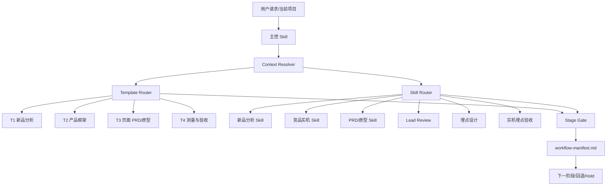

# C 端出海产品完整工作流搭建实施方案 v1.0

> 建设目标：将现有新品分析、竞品研究、PRD/原型、Lead Review、埋点设计和实机验收能力，组装成一套可按阶段运行、可持续接续、可明确验收的工作流。
> 推荐方案：新增一个轻量主控 Skill `overseas-consumer-app-lifecycle`，保留所有现有专项 Skill，通过 Template Router、Skill Router、Gate 和 Manifest 完成编排。

---

## 0. 最重要的搭建判断

第一版不要追求“自动完成整个产品生命周期”，只解决四个高频问题：

1. **判断当前处于哪个阶段。**
2. **选择正确的模板和专项 Skill。**
3. **判断能否进入下一阶段。**
4. **保存当前结论、证据等级和下一步。**

如果这四件事稳定，后面才能逐步增加自动生成、检查和追踪脚本。否则自动化越多，错误范围越大。

---

## 1. 总体架构



### 1.1 主控 Skill

名称：

`overseas-consumer-app-lifecycle`

它只负责：

1. 恢复上下文和 Source of Truth。
2. 判断 Task Type 和 Stage。
3. 选择 T1–T4 模板。
4. 路由到已有专项 Skill。
5. 执行阶段门禁。
6. 更新 Manifest 和交接结果。

它不负责：

1. 自己重新写一套市场研究方法。
2. 自己重新写页面需求和边界库。
3. 自己重新定义埋点命名规则。
4. 自己包含 ADB、Excel、Axure 等具体操作细节。
5. 每次机械运行所有阶段。

### 1.2 两个 Router

**Template Router** 决定输出哪一层文档：

- T1：新品需求分析。
- T2：产品框架与版本方案。
- T3：页面/功能 PRD 和原型标注。
- T4：埋点、测试和验收。

**Skill Router** 决定调用什么能力：

- 市场与立项：`overseas-consumer-app-workflow`。
- Android 竞品实机：`android-app-screenshot`。
- 正式 PRD 包：`prd-prototype-standard`。
- 页面/低保真：`prototype-requirement-writer`。
- 交付评审：`lead-review`。
- 埋点设计：`tracking-spec-from-prototype`。
- 埋点实机验收：`tracking-implementation-validator`。

Template 与 Skill 是正交关系。例如 T3 页面 PRD 可以调用 `prototype-requirement-writer`，也可以在完整需求包中调用 `prd-prototype-standard`；不能把模板层和执行能力混为一谈。

---

## 2. 生命周期状态机

统一使用以下状态：

```text
IDEA
  ↓
DISCOVERY
  ↓
VALIDATION
  ↓
SOLUTION_DEFINED
  ↓
DESIGN
  ↓
READY_FOR_DEV
  ↓
BUILD
  ↓
IMPLEMENTATION_ACCEPTANCE
  ↓
ACCEPTED_HANDOFF
  ↓
ITERATION
```

任意阶段都允许进入：

- `HOLD`：有价值但当前条件不足。
- `NO_GO`：方向或方案不成立。
- `BLOCKED`：缺少权限、设备、数据、工具或用户选择。

### 2.1 状态定义

| 状态 | 代表含义 | 最小完成条件 |
|---|---|---|
| IDEA | 只有方向或想法 | 产品类别和初始假设被记录 |
| DISCOVERY | 正在研究问题和机会 | 用户、场景、市场、竞品研究边界明确 |
| VALIDATION | 正在验证危险假设 | 有实验、阈值和 Go/Hold 条件 |
| SOLUTION_DEFINED | 产品方案已收敛 | 定位、MVP、平台和商业化边界明确 |
| DESIGN | 正在写需求和做原型 | T2/T3 已建立，页面和状态在展开 |
| READY_FOR_DEV | 可交给研发 | PRD/原型一致，AC、依赖和风险完整 |
| BUILD | 正在实现 | 版本、需求和测量方案冻结 |
| IMPLEMENTATION_ACCEPTANCE | 等待研发验收 | 构建、实机、埋点和交付检查已执行 |
| ACCEPTED_HANDOFF | 研发交付完成 | 核心需求、实现和验收证据闭环 |
| ITERATION | 基于已有产品数据优化 | 指标问题、原因假设和实验明确 |

---

## 3. 主控 Skill 目录

第一版建议目录：

```text
C:\Users\simon\.codex\skills\overseas-consumer-app-lifecycle\
├── SKILL.md
├── agents\
│   └── openai.yaml
├── references\
│   ├── task-and-stage-routing.md
│   ├── template-router.md
│   ├── skill-router.md
│   ├── stage-gates.md
│   ├── evidence-levels.md
│   └── source-authority.md
└── assets\
    ├── workflow-manifest-template.md
    ├── decision-log-template.md
    └── handoff-index-template.md
```

第一版不创建 `scripts/`。路由和模板仍在调整期，先用真实项目证明规则稳定；只有同一个机械动作重复三次以上，再考虑脚本化。

### 3.1 `SKILL.md` 保留什么

入口文件建议控制在约 150–250 行，只包含：

1. 适用范围与不适用范围。
2. 默认 Android / Google Play 优先，但必须按项目证据确认。
3. Task Type 与 Stage 判断流程。
4. 必须读取哪些 Router/Gate reference。
5. Source of Truth 优先级。
6. 证据等级规则。
7. 最终交接输出格式。

大量模板、清单、例子放入 references 或 assets，不塞在入口文件中。

### 3.2 建议的触发描述

```yaml
name: overseas-consumer-app-lifecycle
description: Orchestrate an overseas consumer app from opportunity assessment through product definition, PRD/prototype delivery, analytics design, implementation acceptance, and iteration. Use when the user asks to start or continue a complete new-product workflow, determine the current product stage, connect prior product artifacts, or decide the next required deliverable. Route narrow tasks to existing specialist skills instead of running the full lifecycle.
```

保持默认可自动触发；不需要 explicit-only。删除、账号修改等外部操作仍在实际执行时单独受权限边界约束。

---

## 4. Task Type 路由

主控 Skill 首先将请求归入以下类型之一：

| Task Type | 用户表达示例 | 默认路由 |
|---|---|---|
| `DIRECTION_CHECK` | 这个方向能不能做 | T1 精简版 → 方向门禁 |
| `NEW_PRODUCT_FULL` | 开始新品规划、写完整新品分析 | T1 完整版 → T2 |
| `MVP_DEFINITION` | 首版做什么、帮我砍功能 | T1 已有结论 → T2 |
| `FEATURE_PRD` | 写这个功能需求 | T2 核验 → T3 |
| `PROTOTYPE` | 做低保真、Axure/蓝湖交付 | T3 + 原型 Skill |
| `COMPETITOR_AUDIT` | 跑一下这个 Android 竞品 | 竞品 Skill → 更新 T1/T2 证据 |
| `REVIEW` | 交付前帮我挑刺 | 当前 T1/T2/T3 → Lead Review |
| `TRACKING_SPEC` | 根据 PRD 生成友盟埋点表 | 冻结 T3 → T4 埋点设计 |
| `IMPLEMENTATION_ACCEPTANCE` | 检查实机是否实现/埋上 | T4 实机验收 |
| `METRIC_DIAGNOSIS` | 已有产品指标为什么掉了 | ITERATION → 指标诊断 |

### 4.1 窄任务不升级为全流程

用户只要一句文案、一个页面、一项规则或一个语法修改时：

1. 读取必要的产品上下文。
2. 完成当前窄任务。
3. 只在发现方向性红线时提醒。
4. 不自动生成完整新品文档和全量 Manifest。

---

## 5. Template Router

### T1：新品需求分析

使用当前 0–12 章骨架，继承 Heart 的写作方法：

- 结论先行。
- 每章有小结。
- 数据之后必须写产品影响。
- 竞品之后必须写取舍。
- 最终给 Go/Hold、现在做、后置和不做。

### T2：产品框架与版本方案

使用 Heart `需求框架/产品流程/版本信息` 与 Printer 的 P0/P1/P2/No：

- 产品目标和原则。
- 功能树。
- 用户主流程。
- 版本范围。
- 页面清单。
- 商业化、权限、平台差异。
- 预研和依赖。

### T3：页面/功能 PRD 与原型标注

统一结构：

`页面说明 → 页面进入 → 页面模块 → 展示规则 → 交互说明 → 页面状态 → 数据规则 → 异常&边界 → AC → 埋点`

原型关键状态必须展开，英文 UI Copy 和中文需求分离。

### T4：测量与验收

包括：

- 埋点表。
- 测试用例。
- 设备/版本环境。
- PASS/FAIL/BLOCKED/NOT_RUN。
- 失败证据。
- 回归结果。
- 研发交付门禁状态。

---

## 6. Skill Router

| 当前任务 | 主 Skill | 可选配套 | 禁止误路由 |
|---|---|---|---|
| 新品方向/完整分析 | `overseas-consumer-app-workflow` | 市场、竞品、商业化 Skill | 不直接进入页面原型 |
| Android 竞品实机 | `android-app-screenshot` | 文档/PDF 导出 | 不把商店截图当实机体验 |
| 完整 PRD 包 | `prd-prototype-standard` | Lead Review | 不让原型隐藏业务规则 |
| 单页/低保真 | `prototype-requirement-writer` | 前端/设计能力 | 不擅自扩展无关模块 |
| 上级评审 | `lead-review` | 对应产物 Skill | 不把推测意见写成确证原则 |
| 埋点设计 | `tracking-spec-from-prototype` | Spreadsheets | 不使用 `umeng-cli` 代替规格设计 |
| 埋点实机校验 | `tracking-implementation-validator` | Android UI/ADB | 不用页面操作成功代替 PASS |

---

## 7. 四道 Stage Gate

### G1：方向门禁

必须满足：

1. 唯一 Beachhead 用户和主场景。
2. 痛点有用户行为、评论、搜索或数据证据。
3. 下载/触发入口成立。
4. 首次价值可被用户验证。
5. 留存来自真实重复任务。
6. 商业化与价值频率匹配。
7. 平台能力和政策没有不可解红线。

输出：`Go / Conditional Go / Hold / No-Go`。

### G2：方案门禁

必须满足：

1. P0 功能全部映射核心任务或危险假设。
2. 首次价值、返回和复用链路完整。
3. 免费/付费、广告和权限边界明确。
4. Android/iOS 版本范围明确。
5. 高风险技术点有 Spike 或待验证结论。
6. 成功、失败和 Kill Criteria 明确。

### G3：开发交付门禁

必须满足：

1. T1、T2、T3 结论一致。
2. PRD 与原型版本一致。
3. 页面、状态、数据、边界和 AC 完整。
4. 功能与页面可追溯。
5. P0 评审问题关闭。
6. 埋点需要回答的产品问题明确。

### G4：研发验收门禁

必须满足：

1. 构建和目标设备核心路径通过。
2. 订阅、恢复、广告、权限、通知和异常恢复已验收。
3. 关键埋点在设备端验证。
4. 需求承诺、产品实现和数据行为一致。
5. 阻断问题为 0。
6. 遗留问题、降级方案和负责人明确。

---

## 8. 统一证据等级

| 等级 | 定义 | 可使用的结论 |
|---|---|---|
| E0 | 只有计划或文字建议 | 已规划/建议 |
| E1 | 文件、代码或原型已生成 | 已生成 |
| E2 | 结构、语法、公式或 lint 通过 | 静态检查通过 |
| E3 | 可构建或可渲染 | 构建/渲染通过 |
| E4 | 真实设备/模拟器核心路径通过 | 实机验证通过 |
| E5 | 真实 SDK、API、后台或线上数据闭环 | Live E2E 通过 |

规则：

1. 结论不能高于证据等级。
2. 每个平台、每个交付物分别记录等级。
3. 一项 E4 不代表整个项目 E4。
4. 历史结果默认带日期和版本，不能自动视为当前结果。

---

## 9. `workflow-manifest.md`

每个正式项目只保留一个当前 Manifest：

```markdown
# Workflow Manifest

## 项目
- 产品：
- 版本：
- 当前阶段：
- 当前 Task Type：
- 主平台/次平台：
- 首发地区：

## 核心判断
- Beachhead 用户：
- 核心场景：
- 核心任务：
- 一句话定位：
- 当前结论：Go / Conditional Go / Hold / No-Go

## Source of Truth
- T1 新品分析：
- T2 产品框架：
- T3 PRD/原型：
- T4 埋点/测试：

## Gate
- G1：PASS / FAIL / NOT_RUN
- G2：PASS / FAIL / NOT_RUN
- G3：PASS / FAIL / NOT_RUN
- G4：PASS / FAIL / NOT_RUN

## Evidence
- 市场证据：
- Android：E0-E5
- iOS：E0-E5
- 原型：E0-E5
- 埋点：E0-E5

## 范围
- 现在必须做：
- 可以后置：
- 不要做：

## 阻断与未验证
- 阻断项：
- 危险假设：
- 补证动作：

## 下一步
- 动作：
- Owner：
- 输入：
- 输出：
- 决策阈值：
```

### 9.1 Manifest 更新规则

1. 用户只是询问时，不默认写入项目文件。
2. 用户明确开始/继续完整流程时创建或更新。
3. 不覆盖当前 Source of Truth，只记录路径和版本。
4. 只更新本轮确认的字段。
5. 未确认内容写 `[待确认]`，无证据写 `[证据不足]`。

---

## 10. 追踪关系

工作流必须支持从假设追踪到实机：

```text
假设 A-01
  → 产品决策 D-02
    → 功能 F-03
      → 页面/状态 S-05
        → 验收 AC-05-02
          → 事件 EV-018
            → 测试 TC-044
              → 证据 E-044
```

第一版不需要数据库，只需要统一编号规则和 `handoff-index.md`。

建议编号：

- `A-`：Assumption。
- `D-`：Decision。
- `F-`：Feature。
- `S-`：Screen/State。
- `AC-`：Acceptance Criteria。
- `EV-`：Event。
- `TC-`：Test Case。
- `E-`：Evidence。

---

## 11. 分阶段实施计划

### V0.1：主控骨架

完成：

1. 初始化 Skill 目录。
2. 编写短版 `SKILL.md`。
3. 建立 Task/Stage Router。
4. 建立 T1–T4 Template Router。
5. 建立 G1–G4 Gate。
6. 建立 E0–E5 证据规则。
7. 创建 Manifest、Decision Log、Handoff Index 模板。
8. 运行 Skill 结构校验。

验收：面对典型请求能给出正确的 Task Type、Stage、Template、Skill、Gate 和下一步。

### V0.2：接入现有专项 Skill

完成：

1. 为 7 个专项 Skill 定义调用条件和交接字段。
2. 消除重复内容，主控只保留路由。
3. 补齐蓝湖 MCP-first 适配规则。
4. 检查历史模板和当前模板的优先级。

验收：窄任务不会触发全流程；完整任务不会漏掉前置阶段。

### V0.3：回归测试

至少测试以下请求：

1. “这个新品方向能不能做？”
2. “按 Heart Rate 的结构写一份新品分析。”
3. “只做主页低保真。”
4. “帮我检查这个 PRD 能不能交。”
5. “根据这个 PRD 生成友盟埋点表。”
6. “检查这些埋点实机有没有上报。”
7. “已有产品的 D1 掉了，帮我诊断。”

每个测试检查：是否选对模板、是否选对 Skill、是否控制范围、是否正确标证据、是否给出可执行下一步。

### V1.0：真实项目前向验证

建议分两段：

1. 使用 PDF Reader/Doc Reader 做历史回归，验证 T1–T3 和历史决策继承。
2. 选择一个有真实 Android APK、ADB 和设备端埋点工具的项目，跑通 T3→T4→G4，完成首个 E4 样板。

只有真实项目跑通后，才把工作流标记为 V1.0。

---

## 12. 验收主控 Skill 的标准

### 路由正确

- 单页面任务不会被扩成完整新品报告。
- 新品方向不会直接进入原型。
- 埋点设计不会误用 `umeng-cli`。
- 实机验收不会用静态日志冒充 PASS。

### 上下文正确

- 当前用户确认高于历史记忆。
- 当前原型和模板高于历史样例。
- 历史决策保留日期、版本和证据状态。

### 输出正确

- 明确当前 Stage、Template、Skill 和 Gate。
- 明确现在必须做、可以后置、不要做。
- 结论不高于 E0–E5 证据等级。
- 下一步有输入、输出、Owner 建议和决策阈值。

### 维护正确

- 项目特例不会直接升级为全局规则。
- Reviewer 推测与确证意见分离。
- 平台政策每次使用当前官方来源核验。
- 不自动同步 Notion 或执行范围外的外部操作。

---

## 13. 优先级建议

### 现在必须做

1. 搭建 V0.1 主控 Skill。
2. 完成 Router、Gate、Evidence 和 Manifest。
3. 接入现有 7 个专项 Skill，但不修改它们的核心职责。
4. 用 7 个典型请求做回归测试。

### 可以后置

1. 自动创建项目目录。
2. 自动生成追踪矩阵。
3. 自动检查 PRD、原型、埋点和测试断链。
4. Axure 直接写入。
5. 上线看板自动化。

### 不要做

1. 不复制全部专项 Skill 内容到主控 Skill。
2. 不一开始写大量脚本。
3. 不把工作流绑定 Heart、Reader、Printer 某个具体品类。
4. 不要求所有任务必须从 IDEA 开始。
5. 不在没有真实项目跑通前宣布端到端工作流成熟。

---

## 14. 最终推荐

建设路径应当是：

`V0.1 主控骨架 → V0.2 接入现有 Skill → V0.3 七场景回归 → V1.0 真实 Android 项目跑通`

最先创建的不是自动化脚本，而是以下四个核心文件：

1. `SKILL.md`
2. `references/task-and-stage-routing.md`
3. `references/stage-gates.md`
4. `assets/workflow-manifest-template.md`

这四个文件稳定后，再补 Template Router、Skill Router、Evidence 和追踪模板。

一句话判断：**先把“什么时候做什么、做到什么程度才能往下走”固化下来，再自动化“怎么做”；这是这套工作流能长期可用，而不是很快变成另一份过期大文档的关键。**
